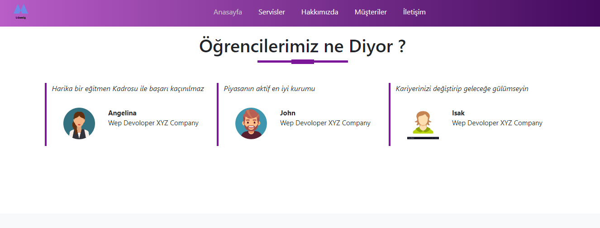

<h1> 
A Website Designed For Software Academia </h1>

<h2>content</h2>

<h3>
    **General information about the academy section 
   **communication section 
   ** services section
   ** customers Comments section 
   ** social media communication area   

</h3>

<h2>Used technologies</h2>

<h3>
    *** HTML5 And CCS were used *** 
    *** Bootstrap library  was used*** 
    *** Enriched with google fonts and Font awesome*** 
    *** All of responsive designe*** 

</h3>

<h2>GIF</h2>

<h2>Here are the ScreenShoots</h2>

